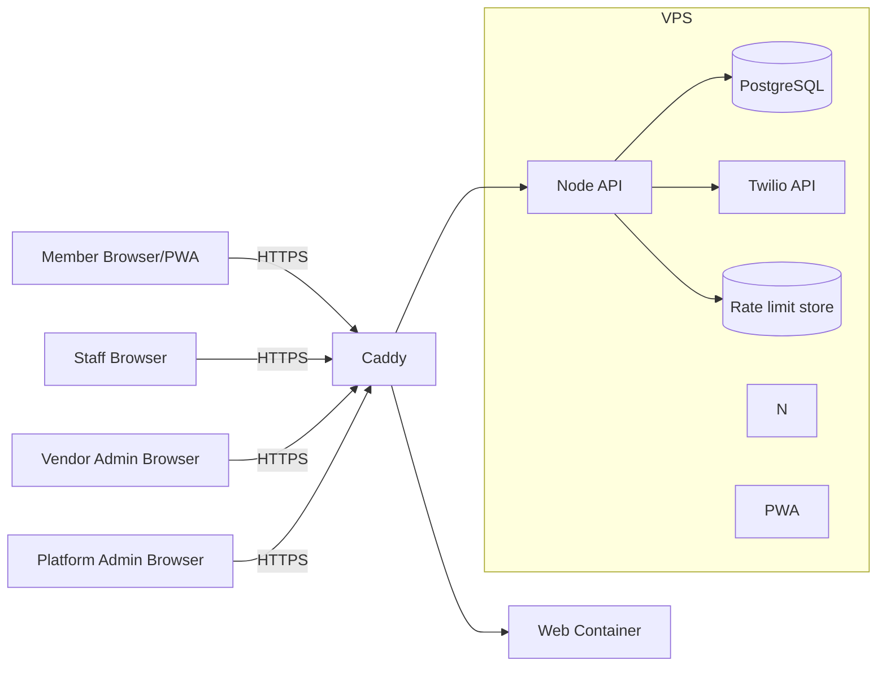

# Architecture — Multi-tenant Loyalty PWA (Afrihost Cloud/VPS, Node)

## 0. Document control
- Version: 1.1
- Date: 2026-01-20
- Hosting: Hetzner VPS
- HTTPS: required (AutoSSL)

## 1. Architectural goals
1. Tenant isolation by `vendor_id` in all data access paths.
2. Ultra-fast stamp/redeem flows suitable for point-of-service.
3. Fraud resistance: rotating single-use tokens + replay protection + auditable staff attribution.
4. Simple deploy/operate on a single VPS: reverse proxy + API + static PWA + database.

## 2. High-level topology



## 3. Components

### 3.1 Static PWA
- Served by **Caddy** (internal web container).
- Tenant routing via URL path `/v/{vendor_slug}`.
- UI themed via vendor branding fetched from API.

### 3.2 Node API
- Provides all REST endpoints (public vendor info, member auth, staff flows, admin portals).
- Enforces authorization and tenant boundaries.
- Signs rotating tokens and enforces replay protection.

### 3.3 PostgreSQL
- Primary system of record.
- Append-only transaction tables.
- Token replay table (`token_use`).

### 3.4 Rate limiting store
- MVP option A: Postgres (simple) with time-window counters.
- Preferred: Redis (recommended on VPS) for efficient rate limits + token replay cache.

### 3.5 OTP provider(s)
- OTP is implemented by sending a one-time code to the member's phone.
- Providers:
  - **SMSFlow** — SMS via the Portal Integration API (ClientID/ClientSecret → bearer token → BulkMessages).
  - **Twilio Programmable Messaging** — WhatsApp or SMS, depending on configuration.
- Integration requires valid provider-specific credentials (`SMSFLOW_CLIENT_ID` / `SMSFLOW_CLIENT_SECRET` or `TWILIO_*`).
- The system supports “send OTP” and “verify OTP” using internal code generation + storage.

## 4. Tenant isolation
- Single DB shared across tenants.
- Every tenant-scoped table includes `vendor_id`.
- API derives vendor context from:
  - URL path vendor_slug -> resolves vendor_id
  - Auth token claims include vendor_id
- Every query for tenant-scoped resources MUST filter by vendor_id.

## 5. Identity and session model

### 5.1 Member auth
- Passwordless: phone + OTP delivered via configured provider (SMSFlow SMS or Twilio WhatsApp/SMS).
- Session token: JWT (access token) stored as httpOnly cookie (preferred) OR in memory/local storage (fallback).
- Session TTL: 30 days; refresh on activity.

### 5.2 Staff auth (username + PIN)
- Staff portal is vendor-scoped. Staff enters username + PIN.
- PIN is stored as a hash and must be unique per staff account within a vendor.
- Session token: JWT, TTL 12 hours, idle timeout 30 minutes.

### 5.3 Admin auth
- Vendor Admin: email+password (recommended) OR separate admin PIN (optional).
- Platform Admin: email+password + MFA (recommended).

## 6. Fraud-resistant rotating token
- Member card screen displays rotating token refreshed every 30 seconds.
- Token properties:
  - server-signed (HMAC)
  - includes `vendor_id`, `card_id`, `member_id`, `jti`, `exp`
  - token is single-use for stamping OR redeeming
- Replay protection:
  - record `vendor_id + jti` as used at first successful stamp/redeem
  - reject reuse

## 7. Transaction integrity
- `stamp_transactions` and `redemption_transactions` are append-only.
- Card state changes are performed within a DB transaction:
  - validate card state
  - enforce cooldown
  - insert token_use
  - update card
  - insert transaction row

## 8. Program versioning
- Each vendor has exactly one active program.
- Program updates create a new program row with incremented version.
- Existing active cards remain tied to their program version.
- New cards use the current active program.

## 9. Operational concerns
- Backups: daily DB backup + weekly full snapshot.
- Logs: structured JSON logs (API) + Caddy access logs.
- Admin audit logs stored in DB.


### Local development (mandatory)
All local development MUST run the full stack inside Docker containers using Docker Compose (Windows 11 supported).
- Do **not** install PostgreSQL, Node, Nginx, or other middleware directly on the developer host.
- Host prerequisites: Docker Desktop (WSL2 engine), Git, IDE (Antigravity).
- Compose MUST provide hot-reload for `apps/api` and `apps/web` via bind mounts.

**Local dev topology (Docker Compose)**
```mermaid
flowchart LR
  Dev[Developer Laptop] -->|Docker Compose| Net[(Docker Network)]
  Net --> WEB[Vite PWA Dev Server]
  Net --> API[Node API (dev)]
  Net --> DB[(PostgreSQL)]
  Net --> REDIS[(Redis - optional)]
  API --> WA[WhatsApp Provider API]
  WEB --> API
```

## 10. Deployment model (VPS)
- **All services containerized via Docker Compose.**
- **Caddy**: Reverse proxy (Auto HTTPS) & Web Server.
- **Node API**: Docker container.
- **PostgreSQL**: Docker container with volume persistence.
- **Redis**: Docker container (optional/future).
- AutoSSL configured for HTTPS

## 11. Security baseline
- HTTPS only, HSTS.
- Strict CORS (allow only the app origin).
- Content Security Policy for PWA.
- Rate limiting on OTP, staff PIN login, stamp, redeem.
- All admin impersonation is auditable and time-bounded.
