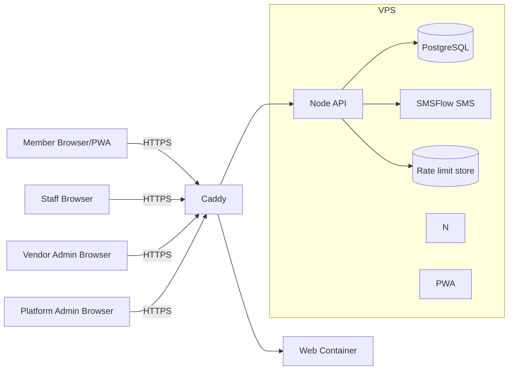

# Architecture — Multi-tenant Loyalty PWA (Afrihost Cloud/VPS, Node)

## 0. Document control
- Version: 1.2
- Date: 2026-05-05
- Hosting: Hetzner VPS
- HTTPS: required (AutoSSL)

## 1. Architectural goals
1. Tenant isolation by `vendor_id` in all data access paths.
2. Ultra-fast stamp/redeem flows suitable for point-of-service.
3. Fraud resistance: rotating single-use tokens + replay protection + auditable staff attribution.
4. Simple deploy/operate on a single VPS: reverse proxy + API + static PWA + database.

## 2. High-level topology

```mermaid
flowchart LR
  M[Member Browser/PWA] -->|HTTPS| P[Caddy]
  S[Staff Browser] -->|HTTPS| P
  VA[Vendor Admin Browser] -->|HTTPS| P
  PA[Platform Admin Browser] -->|HTTPS| P

  P --> API[Node API]
  P --> WEB[Web Container]

  API --> DB[(PostgreSQL)]
  API --> SMS[SMSFlow API]
  API --> RL[(Rate limit store)]

  subgraph VPS
    N
    API
    PWA
    DB
    RL
    SMS[SMSFlow SMS]
  end
```

## 3. Components

### 3.1 Static PWA
- Served by **Caddy** (internal web container).
- Tenant routing via URL path `/v/{vendor_slug}`.
- UI themed via vendor branding fetched from API.
- Route-level code splitting is required only for genuinely heavy screens. Common admin shell routes should stay eager in development so login, dashboard, and sidebar navigation remain immediate, while heavy workflows such as the staff scanner, member card, and vendor detail views can remain lazy-loaded and instrumented for timing.

### 3.2 Node API
- Provides all REST endpoints (public vendor info, member auth, staff flows, admin portals).
- Enforces authorization and tenant boundaries.
- Signs rotating tokens and enforces replay protection.

### 3.3 PostgreSQL
- Primary system of record.
- Append-only transaction tables.
- Token replay table (`token_use`).

### 3.4 Rate limiting store
- MVP option A: Postgres (simple) with time-window counters.
- Preferred: Redis (recommended on VPS) for efficient rate limits + token replay cache.

### 3.5 OTP provider
- OTP is implemented by sending a one-time code to the member's phone.
- Provider: **SMSFlow** — SMS via the Portal Integration API (ClientID/ClientSecret → bearer token → BulkMessages).
- Integration requires valid SMSFlow credentials (`SMSFLOW_CLIENT_ID` / `SMSFLOW_CLIENT_SECRET`).
- The system supports “send OTP” and “verify OTP” using internal code generation + storage.

## 4. Tenant isolation
- Single DB shared across tenants.
- Every tenant-scoped table includes `vendor_id`.
- API derives vendor context from:
  - URL path vendor_slug -> resolves vendor_id
  - Auth token claims include vendor_id
- Every query for tenant-scoped resources MUST filter by vendor_id.
- Vendor-admin HTTP routes (`/api/v1/v/:slug/admin/*`) **must** enforce that the path `:slug` matches the authenticated vendor's `vendor_slug` (JWT carries `vendor_id` only; slug mismatch returns `403`). This is defense-in-depth on top of `vendor_id`-scoped queries.
- Public `GET /api/v1/v/:vendorSlug/portal/status` uses the same slug resolution rules as staff login (`VendorService.resolveBySlug`: vendor exists and status is `ACTIVE` or `TRIAL`). Used by `/vendor/login` to validate a slug before redirecting to `/v/:slug/staff` without leaking tenant branding.

## 5. Identity and session model

### 5.1 Member auth
- Passwordless: phone + OTP delivered via SMSFlow SMS.
- Session token: JWT (access token) stored as httpOnly cookie (preferred) OR in memory/local storage (fallback).
- Session TTL: 30 days; refresh on activity.

### 5.2 Staff auth (username + PIN)
- Staff portal is vendor-scoped. Staff enters username + PIN.
- PIN is stored as a hash and must be unique per staff account within a vendor.
- Session token: JWT, TTL 12 hours, idle timeout 30 minutes.
- Staff with `role: "ADMIN"` can access vendor admin endpoints.
- **`GET /api/v1/staff/me`** (Bearer staff JWT): returns `{ staff_id, name, username, role }` for the enabled staff row matching `staff_id` + `vendor_id` in the token. Used by the vendor admin shell to show who is signed in. Member sessions omit `staff_id` and receive `403 Staff session required`.
- **Operational slug UX**: tenants are addressed by `vendor_slug` in the URL (`/v/{slug}/…`). The marketing entry `/vendor/login` collects the slug once per device (optional); teams should bookmark `/v/{slug}/staff` on fixed hardware. The PWA may persist the last-used slug in `localStorage` for convenience.

### 5.3 Admin auth
- **Vendor Admin / vendor manager**: Authenticates via staff login with `role: "ADMIN"` (same personae as “Vendor Admin” in the PRD). Uses Bearer token (JWT) in `Authorization` header for all vendor admin endpoints (`/api/v1/v/:slug/admin/*`). Token stored in localStorage.
- **Platform Admin**: email+password authentication. Uses HttpOnly cookies (set via `/api/v1/admin/auth/login`). Cookies are used for all platform admin endpoints (`/api/v1/admin/*`).
  - Email addresses are restricted to `@punchcard.co.za` domain (auto-generated from username)
  - Password reset: `/admin/forgot-password` sends reset email, `/admin/reset-password` completes the flow

**Important**: The frontend API client distinguishes between these authentication methods:
- Platform admin routes (`/admin/*`): No Bearer token injection (uses cookies)
- Vendor admin routes (`/v/:slug/admin/*`): Bearer token injection required
- Member/Staff routes: Bearer token injection required

## 6. Fraud-resistant rotating token
- Member card screen displays rotating token refreshed every 30 seconds.
- Token properties:
  - server-signed (HMAC)
  - includes `vendor_id`, `card_id`, `member_id`, `jti`, `exp`
  - token is single-use for stamping OR redeeming
- Replay protection:
  - record `vendor_id + jti` as used at first successful stamp/redeem
  - reject reuse

## 7. Transaction integrity
- `stamp_transactions` and `redemption_transactions` are append-only.
- Card state changes are performed within a DB transaction:
  - validate card state
  - enforce cooldown
  - insert token_use
  - update card
  - insert transaction row

## 8. Program versioning
- Each vendor has exactly one active program.
- Program updates create a new program row with incremented version.
- Existing active cards remain tied to their program version.
- New cards use the current active program.

## 9. Operational concerns
- Backups: daily DB backup + weekly full snapshot.
- Logs: structured JSON logs (API) + Caddy access logs.
- Admin audit logs stored in DB.

### 9.1 Vendor analytics pipeline (MVP)
- Vendor analytics is served by tenant-scoped vendor-admin endpoints under `/api/v1/v/:slug/admin/*`.
- Calculations are computed from:
  - `members` (growth/activity)
  - `card_instances` (completion and near-reward state)
  - `stamp_transactions` and `redemption_transactions` (usage, behavior, and staff throughput)
  - `vendors.average_visit_value` and `vendors.reward_cost` (estimated revenue/ROI)
- Reporting windows are normalized to:
  - current month
  - previous month
  - rolling 30 days
- Estimated metrics are explicitly labeled as estimated in API and UI contracts.

### Local development (mandatory)
All local development MUST run the full stack inside Docker containers using Docker Compose (Windows 11 supported).
- Do **not** install PostgreSQL, Node, Nginx, or other middleware directly on the developer host.
- Host prerequisites: Docker Desktop (WSL2 engine), Git, IDE (Antigravity).
- Compose MUST provide hot-reload for `apps/api` and `apps/web` via bind mounts.

**Local dev topology (Docker Compose)**
```mermaid
flowchart LR
  Dev[Developer Laptop] -->|Docker Compose| Net[(Docker Network)]
  Net --> WEB[Vite PWA Dev Server]
  Net --> API[Node API (dev)]
  Net --> DB[(PostgreSQL)]
  Net --> REDIS[(Redis - optional)]
  API --> SMS[SMS Provider API]
  WEB --> API
```

## 10. Deployment model (VPS)
- **All services containerized via Docker Compose.**
- **Caddy**: Reverse proxy (Auto HTTPS) & Web Server.
- **Node API**: Docker container.
- **PostgreSQL**: Docker container with volume persistence.
- **Redis**: Docker container (optional/future).
- AutoSSL configured for HTTPS

## 11. Security baseline
- HTTPS only, HSTS.
- Strict CORS (allow only the app origin).
- Content Security Policy for PWA.
- Rate limiting on OTP, staff PIN login, stamp, redeem.
- All admin impersonation is auditable and time-bounded.
