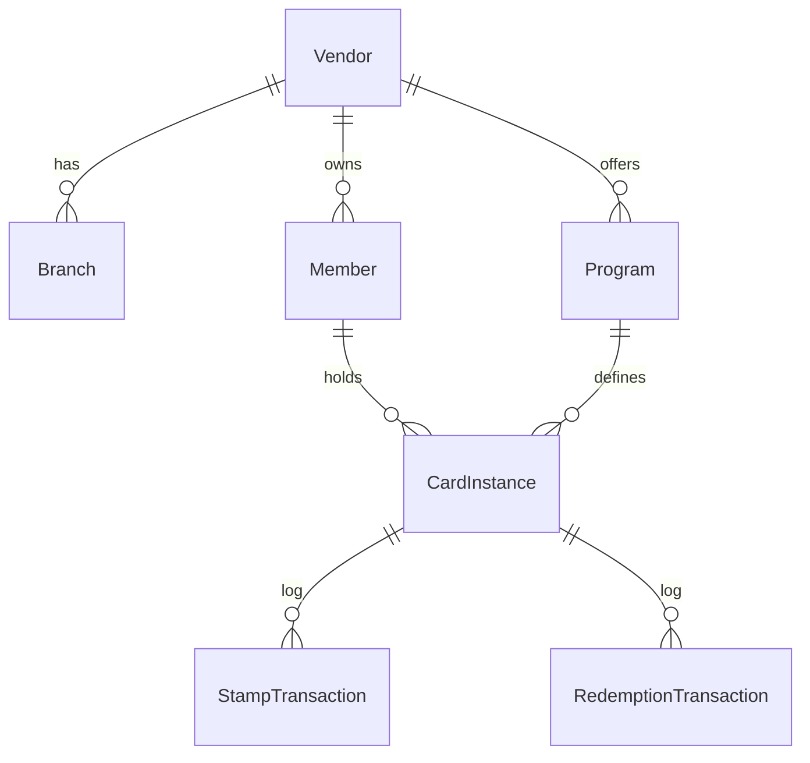

# Database Schema Documentation

## Overview
The database is implemented in PostgreSQL using Prisma ORM.

## Models

### Tenancy
*   **Vendor** (`vendors`): Root tenant.
*   **VendorBranding** (`vendor_branding`): Theming configuration.
*   **Branch** (`branches`): Physical locations.

### Users & Access
*   **StaffUser** (`staff_users`): Employees who stamp/redeem (Role: `STAMPER`, `ADMIN`).
*   **Member** (`members`): End-users identified by phone (`phone_e164`).

### Core Loyalty
*   **Program** (`programs`): Loyalty logic (stamps required, rewards).
*   **CardInstance** (`card_instances`): A member's progress on a specific program.

### Transactions (Append-Only)
*   **StampTransaction** (`stamp_transactions`): Record of stamps added.
*   **RedemptionTransaction** (`redemption_transactions`): Record of rewards claimed.
*   **TokenUse** (`token_use`): Replay protection log for scan tokens.

## Key Constraints

### Partial Uniqueness (Enforced by Database)
1.  **Strictly Single Active Program**:
    *   A vendor can have multiple programs (versions), but only **one** can have `is_active = true`.
    *   Index: `CREATE UNIQUE INDEX ... ON programs(vendor_id) WHERE is_active = true`

2.  **Strictly Single Active Card**:
    *   A member can only have **one** `ACTIVE` card per vendor at a time.
    *   Index: `CREATE UNIQUE INDEX ... ON card_instances(vendor_id, member_id) WHERE status = 'ACTIVE'`

### Replay Protection
*   **Token Uniqueness**: `TokenUse` has a composite Primary Key `(vendor_id, token_jti)`. Attempting to process the same token JTI twice for the same vendor will fail with a constraint violation.

## ER Diagram

