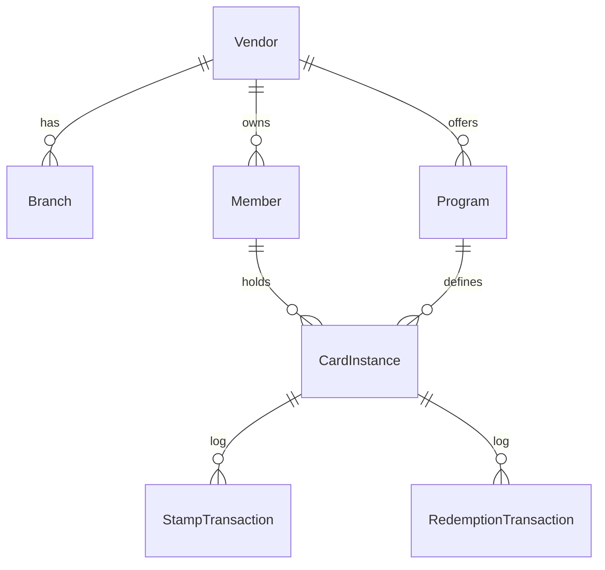

# Database Schema Documentation

## Overview
The database is implemented in PostgreSQL using Prisma ORM.

## Models

### Tenancy
*   **Vendor** (`vendors`): Root tenant.
    - `average_visit_value` (`DECIMAL(10,2)`, required): vendor-defined estimate of spend per stamp visit.
    - `reward_cost` (`DECIMAL(10,2)`, required): vendor-defined cost per redemption.
*   **VendorBranding** (`vendor_branding`): Theming configuration.
*   **Branch** (`branches`): Physical locations.

### Users & Access
*   **AdminUser** (`admin_users`): Platform administrators (Role: `SUPER_ADMIN`, `SUPPORT`).
    - `username`: Unique identifier (e.g., `admin`, `judy.smith`)
    - `email`: Auto-generated as `{username}@punchcard.co.za` (immutable)
    - `first_name`, `last_name`: Admin's full name
    - `reset_token`, `reset_token_exp`: Password reset functionality
*   **StaffUser** (`staff_users`): Employees who stamp/redeem (Role: `STAMPER`, `ADMIN`).
*   **VendorAdminUser** (`vendor_admin_users`): Vendor owners/managers who use email + password for admin tasks.
*   **VendorRegistration** (`vendor_registrations`): Pending self-service vendor registrations with hashed email verification codes.
*   **Member** (`members`): End-users identified by phone (`phone_e164`).

### Core Loyalty
*   **Program** (`programs`): Loyalty logic (stamps required, rewards).
*   **CardInstance** (`card_instances`): A member's progress on a specific program.

### Transactions (Append-Only)
*   **StampTransaction** (`stamp_transactions`): Record of stamps added.
*   **RedemptionTransaction** (`redemption_transactions`): Record of rewards claimed.
*   **TokenUse** (`token_use`): Replay protection log for scan tokens.

## Key Constraints

### Partial Uniqueness (Enforced by Database)
1.  **Strictly Single Active Program**:
    *   A vendor can have multiple programs (versions), but only **one** can have `is_active = true`.
    *   Index: `CREATE UNIQUE INDEX ... ON programs(vendor_id) WHERE is_active = true`

2.  **Strictly Single Active Card**:
    *   A member can only have **one** `ACTIVE` card per vendor at a time.
    *   Index: `CREATE UNIQUE INDEX ... ON card_instances(vendor_id, member_id) WHERE status = 'ACTIVE'`

### Replay Protection
*   **Token Uniqueness**: `TokenUse` has a composite Primary Key `(vendor_id, token_jti)`. Attempting to process the same token JTI twice for the same vendor will fail with a constraint violation.

### Tenant-Scoped Referential Integrity (Enforced by Database)
Cross-vendor references on tenant-owned records are blocked via composite unique keys and composite foreign keys.

**Branch references** (Phase 1):
1.  **Branch composite unique key**: `UNIQUE (vendor_id, branch_id)` on `branches`.
2.  **StaffUser**: `FOREIGN KEY (vendor_id, branch_id) REFERENCES branches(vendor_id, branch_id)`.
3.  **Member**: `FOREIGN KEY (vendor_id, branch_joined_id) REFERENCES branches(vendor_id, branch_id)` (`NULL` allowed).
4.  **StampTransaction / RedemptionTransaction**: `FOREIGN KEY (vendor_id, branch_id) REFERENCES branches(vendor_id, branch_id)`.

**Record references** (Phase 2):
5.  **Composite unique keys** on parent tables: `members(vendor_id, member_id)`, `programs(vendor_id, program_id)`, `card_instances(vendor_id, card_id)`, `staff_users(vendor_id, staff_id)`.
6.  **CardInstance**: `FOREIGN KEY (vendor_id, member_id) REFERENCES members(...)` and `FOREIGN KEY (vendor_id, program_id) REFERENCES programs(...)`.
7.  **StampTransaction / RedemptionTransaction**: `FOREIGN KEY (vendor_id, card_id) REFERENCES card_instances(...)` and `FOREIGN KEY (vendor_id, staff_id) REFERENCES staff_users(...)`.
8.  **WebAuthnCredential**: `FOREIGN KEY (vendor_id, member_id)` and `FOREIGN KEY (vendor_id, staff_id)` with nullable member/staff columns.

Platform admin staff APIs validate branch ownership in application code before write. Card creation validates member ownership before insert.

## ER Diagram

```mermaid
erDiagram
    Vendor ||--o{ Branch : "has"
    Vendor ||--o{ Member : "owns"
    Vendor ||--o{ Program : "offers"
    
    Member ||--o{ CardInstance : "holds"
    Program ||--o{ CardInstance : "defines"
    
    CardInstance ||--o{ StampTransaction : "log"
    CardInstance ||--o{ RedemptionTransaction : "log"
```
